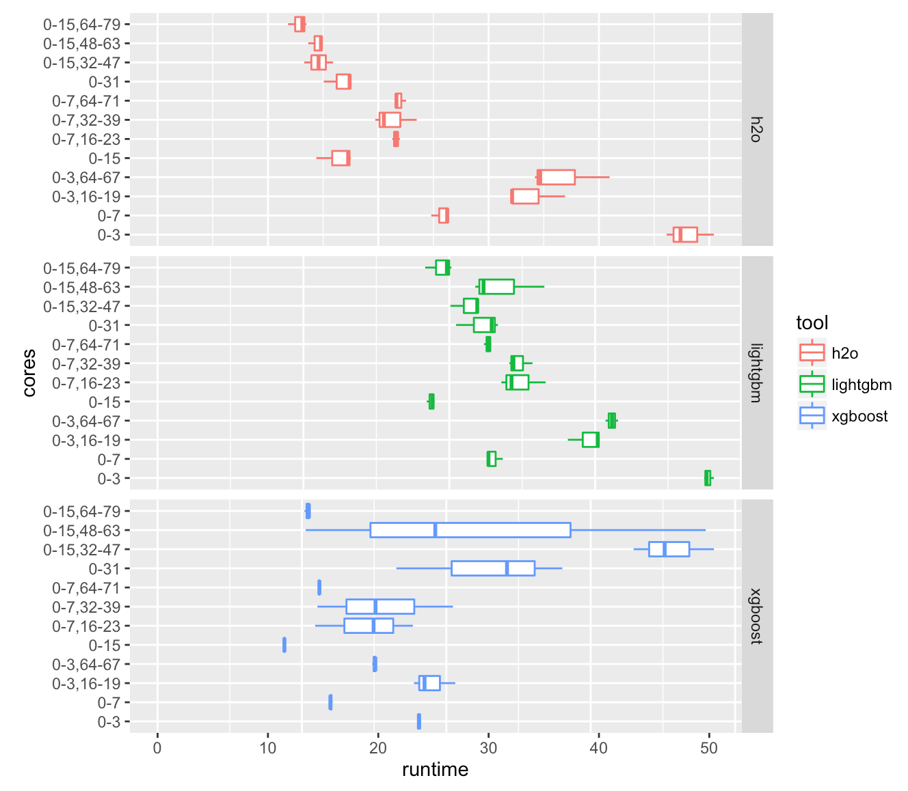
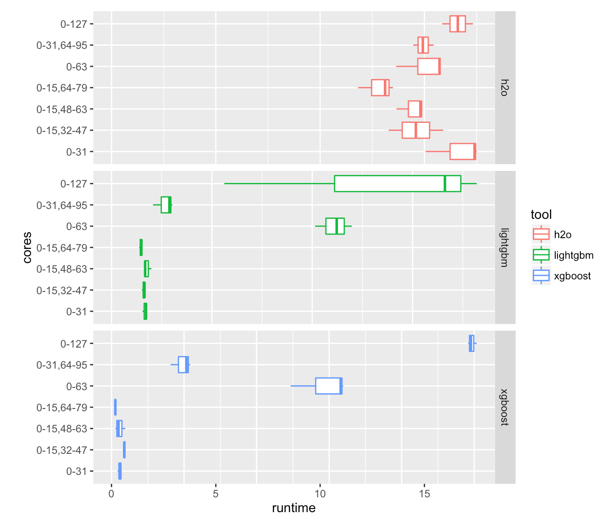

# GBM multicore scaling
## h2o, xgboost and lightgbm on multicore and multi-socket systems

Despite the deep learning hype, on most supervised learning problems with tabular data 
(commonly encountered in business) gradient boosting machines (GBMs) are often the
winning single-algorithm solution (winning in accuracy).

The 3 best (in speed, memory footprint and accuracy) open source implementations for GBMs 
are xgboost, h2o and lightgbm (see [benchmarks](https://github.com/szilard/benchm-ml)).

In this repo I'll take a look at the scalability of h2o, xgboost and lightgbm as a function
of the number of CPU cores and sockets on various Amazon EC2 instances. 
Previous [experiments](https://github.com/szilard/ml-x1) have shown significant slow-down
of xgboost on multi-socket systems.

### r3.8xlarge (32 cores)

r3.8xlarge has 2 CPU sockets with 8+8 hyperthreaded cores each.
Cores 0-7 are on CPU1, 8-15 on CPU2, then 16-23 are hyperthread pairs of 0-7 etc.

Relative training times:

Contrary to the [previous results](https://github.com/szilard/ml-x1)
(with previous versions of xgboost), having 2 CPU sockets
causes little or no degradation of runtime for all 3 software tools, 
see e.g. the `0-7` vs `0-3,8-11` results. 

However, by adding hyperthreaded (HT) cores one gets only a partial speedup (vs adding "real" cores),
see e.g. `0-3` to `0-3,16-19` (HT) vs `0-3` to `0-7` results (with all tools).

When all cores are used adding the last HT cores can actually hurt performance (most significantly
xgboost is faster on 15 cores than 32 cores).

### x1.32xlarge (128 cores)

x1.32xlarge has 4 CPU sockets with 16+16 hyperthreaded cores each. Cores 0-15 are on CPU1, 16-31 on CPU2 etc., then 64-79 are hyperthread pairs of 0-15 etc.

Relative training times:

